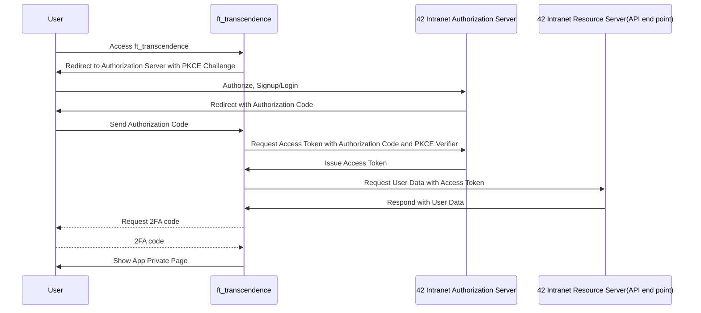
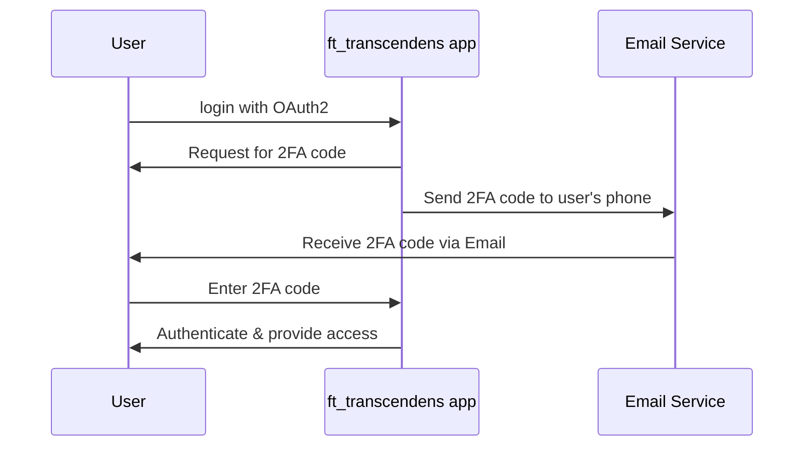

以下は、サインアップの局面を解説する内容に修正した記事です。

---

### Googleの例
OAuth 2.0のプロトコルにおいて、同一のエンティティ（この場合、Google）が複数の役割を果たすことがあります。具体的には以下のような役割があります：

1. **認可サーバー（Authorization Server）**：
   - GoogleはOAuth 2.0の認可サーバーの役割も果たします。これは、第三者のクライアントアプリケーション（例えば、ウェブアプリケーションやモバイルアプリケーション）がGoogleのユーザーデータにアクセスするための許可を得られるようにする役割です。
   - 認可サーバーは、エンドユーザーの認証と認可を行い、クライアントアプリケーションに対してアクセストークンを発行します。この段階でアカウント作成もしくはログイン処理が行われます。

2. **リソースサーバー（Resource Server）**：
   - Googleはまた、リソースサーバーの役割も果たします。リソースサーバーは、保護されたユーザーデータを保持し、管理します。
   - クライアントアプリケーションは、認可サーバーから発行されたアクセストークンを使用して、リソースサーバーにアクセスを行います。リソースサーバーは、このトークンを検証し、有効であればクライアントに対してリソースへのアクセスを許可します。このアクセスを通じて、WebSocketの接続確立も行われます。

---

### トラセンの場合
SPA (Single Page Application) においては、一般に「Authorization Code Flow with PKCE」が推奨されます。以下は、あなたのアプリケーション（ft_transcendence）がリソースサーバー（"42 intranet"）に対してOAuth 2.0を使用して認可を行う場合の、Mermaid記法を使用したフロー図です：

---

このフロー図では、

- **User** はエンドユーザーです。
- **ft_transcendence** はあなたのSPA（Single Page Application）です。
- **42 Intranet Authorization Server** はOAuth 2.0の認可を担当するサーバーです。
- **42 Intranet Resource Server(API end point)** はユーザーデータをホストするリソースサーバー（"42 intranet"）が提供するAPIエンドポイントです。
- **WebSocket** はft_transcendenceとのリアルタイム通信を確立するための接続です。

以下の手順に従って、認可とアカウントの処理が進行します：

1. ユーザーがft_transcendenceにアクセスします。
2. ft_transcendenceは、PKCE（Proof Key for Code Exchange）チャレンジと共に、ユーザーを認可サーバーにリダイレクトします。
3. ユーザーは認可サーバーでログインし、ft_transcendenceに対するアクセス許可を与えます。
4. 認可サーバーは認可コードを含むリダイレクトレスポンスをユーザーに送ります。
5. ユーザーはこの認可コードをft_transcendenceに送ります。
6. ft_transcendenceは、この認可コードとPKCE検証コードを使用して、認可サーバーにアクセストークンをリクエストします。
7. 認可サーバーはアクセストークンをft_transcendenceに発行します。
8. ft_transcendenceはこのアクセストークンを使用して、42 Intranetリソースサーバーからユーザーデータ（ユーザー名、Emailアドレス、アバター、etc...）をリクエストします。
9. リソースサーバーは要求されたユーザーデータをft_transcendenceに応答します。
10. ft_transcendenceはユーザーデータを基に、ユーザーのアカウントを作成またはログイン処理を行います。
11. ログイン処理が完了すると、ログイン後のページをユーザーに表示します。
※ログイン時にWebSocketの接続確立を行い、その後のチャットやゲームでこのWebSocketの接続を利用する。
---
## 2要素認証 (Two-Factor Authentication: 2FA)

2要素認証は、アカウントの安全性を高めるためのセキュリティ手段です。従来のユーザー名とパスワードだけではなく、もう1つの認証要素を追加することで、不正アクセスのリスクを軽減します。2FAは多くの場合、SMSメッセージ、Eメール、認証アプリなどを使用した一時的なコードを必要とします。

例えば、ユーザーがアカウントにログインする際、ユーザー名とパスワードの入力の後、携帯電話などに送られる一時的なコードをさらに入力することで、認証が完了するという流れが一般的です。

### 2要素認証を取り入れたシーケンス図

このフロー図では、ユーザーがまずユーザー名とパスワードでログインを試みます。認可サーバーは、2FAコードをユーザーのEmailアドレスに送信することをリクエストし、ユーザーはそのコードを受け取って認可サーバーに入力します。コードが正確であれば、ユーザーはアクセスが許可されます。

この2要素認証をOAuth2.0の認可の一部として取り入れることで、アカウントのセキュリティを高めることができます。