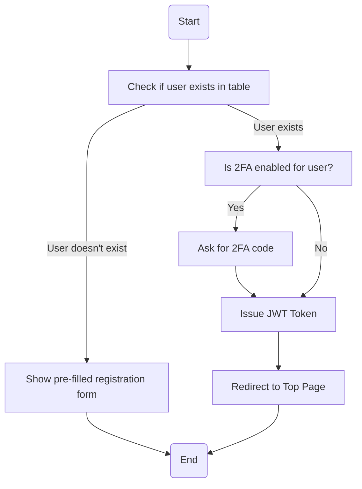

```mermaid
graph TB
    Start(Start)
    CheckUser[Check if user exists in table]
    Register[Show pre-filled registration form]
    2FA_Check[Is 2FA enabled for user?]
    Ask2FA[Ask for 2FA code]
    IssueJWT[Issue JWT Token]
    RedirectToTop[Redirect to Top Page]
    End(End)

    Start --> CheckUser
    CheckUser -->|User doesn't exist| Register
    Register --> End
    CheckUser -->|User exists| 2FA_Check
    2FA_Check -->|Yes| Ask2FA
    Ask2FA --> IssueJWT
    2FA_Check -->|No| IssueJWT
    IssueJWT --> RedirectToTop
    RedirectToTop --> End
```
