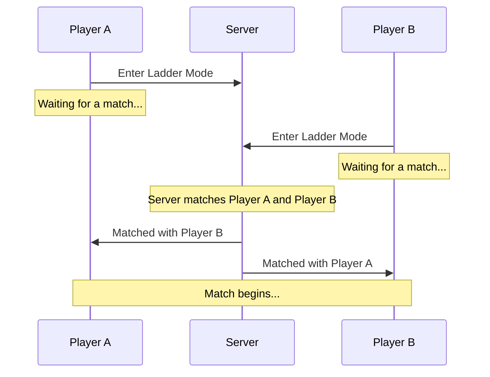
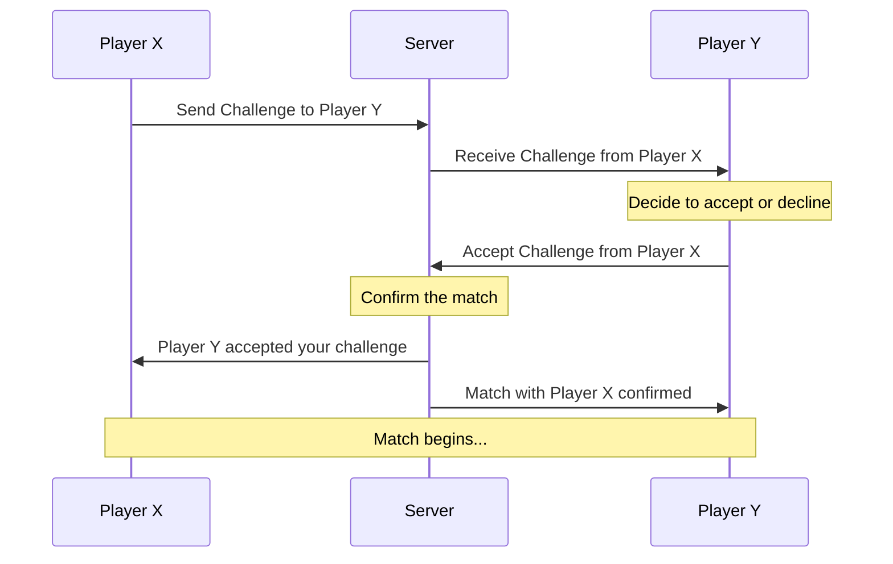
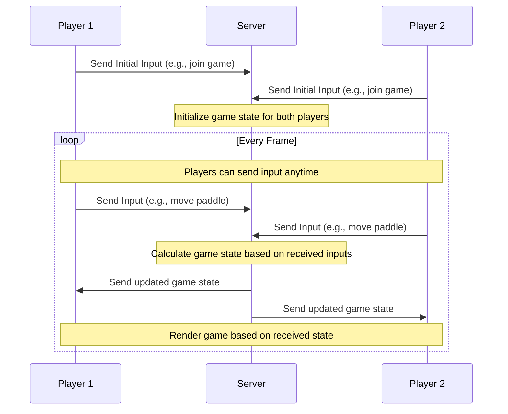

# マッチング
### 1. Ladderモード
---

### 2. 対戦申し込み

---
これらのシーケンス図は、Ladderモードと対戦申し込みの基本的な流れを示しています。オンライン対戦の具体的なシステムや要件に応じて、さらに詳細を追加することも可能です。
---

# 対戦
リアルタイム入力を取り入れたオンライン対戦Pongゲームのシーケンス図

---

---

このシーケンス図では、プレイヤーがいつでもサーバーに入力を送信できることを示しています。サーバーは受信した入力を元に、次のフレームのゲーム状態を計算し、その結果をプレイヤーに送信します。この方法で、サーバーとクライアント間の通信が効率的に行われ、リアルタイムのゲームプレイ体験が実現されます。