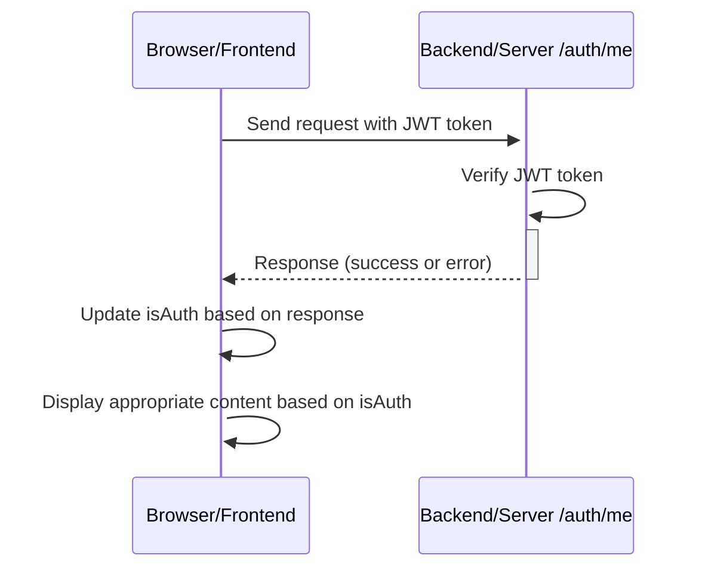

```mermaid
sequenceDiagram
    participant Browser as Browser/Frontend
    participant Server as Backend/Server /auth/me

    Browser->>+Server: Send request with JWT token
    Server->>+Server: Verify JWT token
    Server-->>-Browser: Response (success or error)
    Browser->>+Browser: Update isAuth based on response
    Browser->>+Browser: Display appropriate content based on isAuth
```