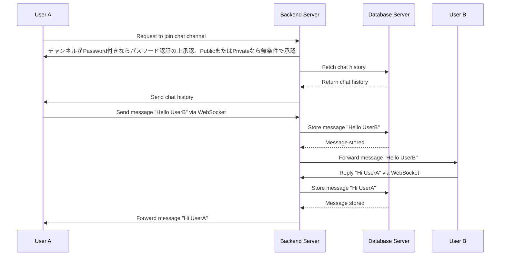

参加者：
- UserA: チャンネルに参加し、メッセージを送信するユーザー
- Backend: WebSocket接続を管理し、メッセージを転送するバックエンドサーバ
- DB: メッセージやチャットルームの情報を保存するデータベースサーバ
- UserB: チャンネルに参加し、メッセージを受信するユーザー

Mermaid記法でのシーケンス図：

このシーケンス図の説明：

1. UserAはバックエンドサーバにチャットチャンネルへの参加をリクエストします。
2. バックエンドサーバはデータベースサーバからチャットの履歴を取得します。
3. バックエンドサーバはUserAにチャットの履歴を送信し、WebSocketの接続を確立します。
4. UserBも同様のプロセスでチャットチャンネルに参加します。
5. UserAが"Hello UserB"というメッセージを送信すると、このメッセージはバックエンドサーバに転送され、データベースに保存されます。
6. その後、バックエンドサーバはこのメッセージをUserBに転送します。
7. UserBが"Hi UserA"というメッセージで返答すると、このプロセスも同様に進行します。

このシーケンス図は、WebSocketを使用した基本的なチャット通信を示していますが、エラーハンドリング、再接続ロジック、セキュリティなどの要件を考慮する必要があることを念頭に置いてください。