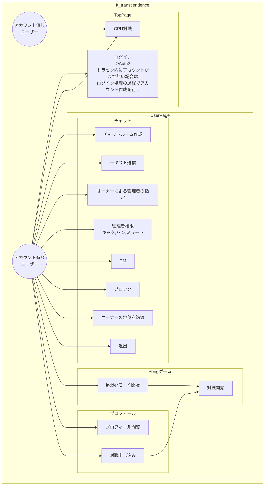

## そもそもユースケース図とは
ユースケースはアクターに対して、何らかの結果を生み出します（「価値を与える」といい換えることもできます）。アクターは、そのユースケースを利用することで、何らかの便益を得ることができます。逆にいうと、**アクターに対して何の便益も与えられない機能／振る舞いは、ユースケースではない**といえます。このユースケースを定義することにより、システムがユーザに提供する有用な機能を特定することができます。

竹政 昭利,林田 幸司,大西 洋平,三村 次朗,藤本 陽啓,伊藤 宏幸. かんたん UML入門［改訂2版］ (Japanese Edition) (pp.101-102). Kindle 版. 

---
※Mermaid記法には、アクターを示す人形のアイコンが存在しない

