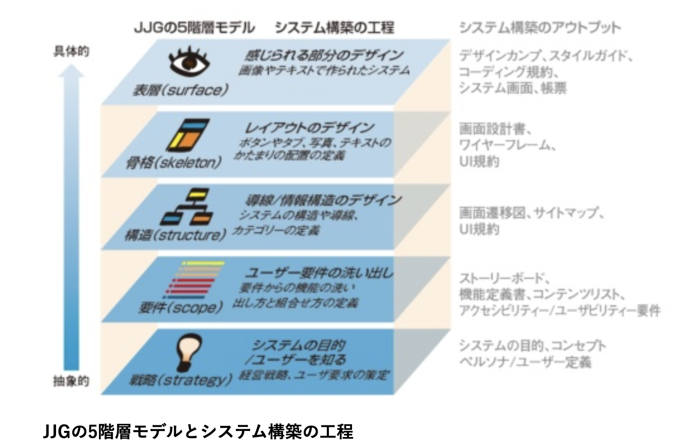

# UIデザインロードマップ
JJGの５階層モデルという形で定義されたものを参考にする。
注：課題要件として使用要求が定まっているので、今回は４階層から行う

### タスクと成果物
 - ４階層 ワイヤーフレーム
 - ５階層 StoryBookでのコンポーネントの作成、全体の雰囲気（テーマ）決定
他にも考えられるが今回はまずこれに着手する

### ワイヤーフレーム例

### Storybook例

---
## 紹介：JJGの5階層モデル

## 1. 戦略（Strategy）

### 成果物: プロジェクトビジョン文書、ユーザーペルソナ

#### 方法:
1. **ユーザーニーズの特定**
    - ユーザーインタビュー、アンケート、ユーザー調査を行い、その結果を分析。
  
2. **ビジネス目標の設定**
    - ステークホルダーインタビュー、SWOT分析などを行い、ビジネスの目標を文書化。

3. **ゴールの整合性確認**
    - ユーザーニーズとビジネス目標のギャップ分析を行う。

## 2. スコープ（Scope）

### 成果物: 機能要件文書、コンテンツ要件文書

#### 方法:
1. **機能要件の一覧作成**
    - ブレインストーミング、ユーザーストーリーマッピングなどを行い、要件を明確にリストアップ。

2. **コンテンツ要件の明示**
    - カードソーティング、コンテンツオーディットを用いて、必要なコンテンツを特定。

## 3. ストラクチャ（Structure）

### 成果物: ユーザーフローチャート、情報アーキテクチャ図

#### 方法:
1. **ユーザーフローの設計**
    - スケッチ、ワイヤーフレームツールを用いて、ユーザーがどのように目標を達成するかを視覚化。
  
2. **情報アーキテクチャの構築**
    - サイトマップ作成ツールや手書きのドラフトを用いて、ページの階層構造を設計。

## 4. スケルトン（Skeleton）

### 成果物: ワイヤーフレーム、プロトタイプ

#### 方法:
1. **ワイヤーフレームの作成**
    - スケッチ、専用のデザインツール（例：Adobe XD、Figma）を用いて基本的なUIレイアウトを設計。

2. **プロトタイピング**
    - プロトタイピングツール（例：InVision, Figma）を使用して、クリッカブルなプロトタイプを作成。

## 5. サーフェス（Surface）

### 成果物: ハイフィデリティモックアップ、完成したUI

#### 方法:
1. **モックアップの設計**
    - Adobe XD、Sketch、Figmaなどを用いて、高度なビジュアルデザインを含むモックアップを作成。

2. **実装とテスト**
    - フロントエンドフレームワーク（例：React, Angular）でデザインをコードに落とし込み、ユーザーテスティングを行う。

このように、JJGの5階層モデルをステップバイステップで進めることで、プロジェクトは戦略から具体的なUI設計まで総合的に進展します。それぞれのステップで作成される成果物は、次のステップへと進む上での重要な土台となります。